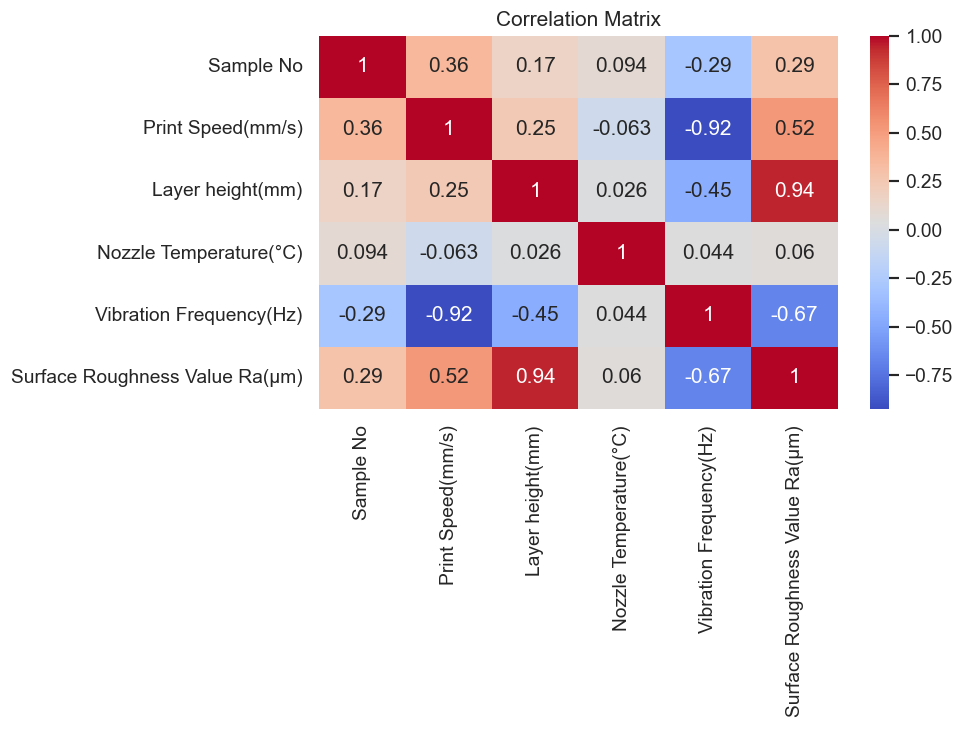
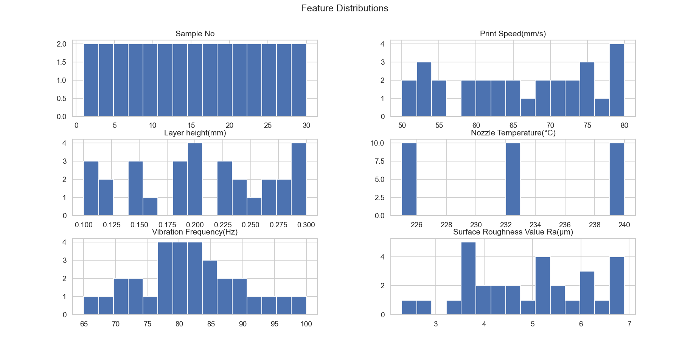

# 📊 In-Situ Surface Roughness Prediction using Vibration Data (3D Printing)

## 🔹 Project Overview

This project aims to predict **surface roughness (Ra)** in FDM 3D printing using **machine learning models** and **in-situ vibration data** collected from a multi-axis accelerometer.

Traditional surface roughness measurement is done **post-print**, leading to:
- ❌ Material waste  
- ❌ Time loss  
- ❌ No real-time quality control  

👉 This project explores whether **real-time vibration signals** can help predict surface quality **during printing**.

---

## 🎯 Objective

- Build regression models to predict **Surface Roughness (Ra)**
- Evaluate whether **vibration frequency improves prediction accuracy**
- Identify **dominant process parameters**

---

## 📂 Dataset Description

| Feature | Description |
|--------|------------|
| Print Speed (mm/s) | Speed of extrusion |
| Layer Height (mm) | Thickness of each printed layer |
| Nozzle Temperature (°C) | Extrusion temperature |
| Vibration Frequency (Hz) | In-situ accelerometer signal |
| Surface Roughness (Ra) | Target variable (µm) |

- Total Samples: **30**
- No missing values
- Clean dataset

---

## 🔍 Exploratory Data Analysis (EDA)

### 📊 Feature Distributions

- Data is **well distributed**
- No extreme skewness
- No missing values

### 📉 Target Distribution (Ra)

- Range: **2.3 → 6.9 µm**
- Slightly skewed but acceptable
- No transformation required

---

## 🔗 Feature Relationships

### 🔥 Strong Relationships Observed:

| Feature | Correlation with Ra |
|--------|--------------------|
| Layer Height | **+0.94 (Very Strong)** |
| Vibration Frequency | **-0.67 (Strong)** |
| Print Speed | +0.52 (Moderate) |
| Nozzle Temperature | +0.06 (Negligible) |

---

## 📌 Key Insight

- **Layer Height** is the dominant factor affecting surface roughness  
- **Vibration Frequency shows strong negative correlation**  
  → Higher vibration → smoother surface  

---

## 📈 Scatter Plot Insights

### Layer Height vs Ra
- Strong linear increase  
- Primary driver of surface roughness  

### Vibration vs Ra
- Clear **negative trend**  
- Indicates meaningful physical relationship  

### Nozzle Temperature
- No clear pattern → weak feature  

---

## 🧠 Multicollinearity Observation

- Print Speed ↔ Vibration: **-0.92**
- Indicates strong dependency between features

👉 This affects model interpretation (especially linear regression)

---

## ⚙️ Machine Learning Models

### 🔹 Baseline Model (Dummy Regressor)

| Metric | Value |
|------|------|
| RMSE | 1.05 |
| R² | -0.05 |

---

### 🔹 Linear Regression

| Metric | Value |
|------|------|
| RMSE | **0.19** |
| R² | **0.965** |

✔ Excellent performance  
⚠ Coefficients affected by multicollinearity  

---

### 🔹 Random Forest Regressor

| Metric | Value |
|------|------|
| RMSE | 0.21 |
| R² | 0.959 |

### Feature Importance:

| Feature | Importance |
|--------|-----------|
| Layer Height | **0.88 🔥** |
| Vibration | **0.067 ⭐** |
| Print Speed | 0.037 |
| Nozzle Temp | 0.01 |

---

## 🔁 Cross-Validation (K=5)

| Metric | Value |
|------|------|
| Mean RMSE | **0.20** |
| Mean R² | **0.968** |

✔ Stable performance  
✔ No overfitting  

---

## 🧪 Ablation Study (Core Experiment)

### Without Vibration:
- RMSE: **0.2019**

### With Vibration:
- RMSE: **0.2024**

### Result:
- ❌ No improvement
- Change: **-0.23%**

---

## ⚠️ Final Conclusion

Although vibration frequency shows a **strong correlation** with surface roughness:

👉 It **does not significantly improve prediction accuracy** in this dataset.

### Reasons:

1. **Layer Height dominates prediction (0.94 correlation)**
2. **Vibration is highly correlated with Print Speed (-0.92)**
3. **Small dataset (30 samples)** limits model generalization

---

## 🔬 Key Contribution

- Validated that **vibration signals contain meaningful information**
- Identified **redundancy between process parameters and vibration**
- Demonstrated **high-accuracy Ra prediction using simple models**

---

## 🚀 Future Work

To improve results:

- Extract advanced vibration features:
  - RMS
  - FFT-based features
  - Signal energy
- Increase dataset size
- Use real-time streaming data
- Implement deep learning models (LSTM / CNN)

---

## 🛠️ Tech Stack

- Python  
- Pandas, NumPy  
- Matplotlib, Seaborn  
- Scikit-learn  

---

## 📌 Project Pipeline
3D Printer → Accelerometer → Data Collection → ML Model → Ra Prediction

---

## 🌍 SDG Alignment

- ♻ Responsible Consumption and Production  
- 🏭 Industry, Innovation and Infrastructure  
- 🌱 Climate Action  

---

## 👨‍💻 Author

Partha Kesav Reddy Chundi  

---

## ⭐ Final Note

This project demonstrates how **machine learning + sensor data** can enable **real-time quality monitoring** in additive manufacturing, reducing waste and improving efficiency.

## 📸 Visualizations

